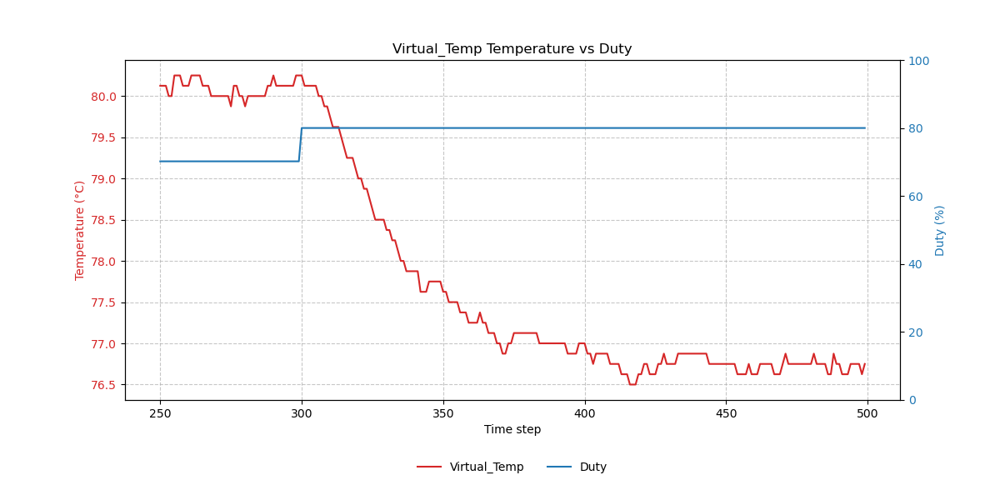

# phosphor-pid-autotune

`phosphor-pid-autotune` is an OpenBMC tool designed to automate the tuning of
PID control loops for fans. It performs step-response experiments to identify
the thermal process model (First Order Plus Dead Time - FOPDT) and calculates
optimal PID gains using the Internal Model Control (IMC) tuning method.

A compact, GitHub-friendly derivation of **FOPDT**

$$
G(s)=\frac{k e^{-\theta s}}{\tau s + 1}
$$

and **IMC PID** rules is in **[`docs/fopdt.md`](docs/fopdt.md)**.

## Features

- **Automated Step Experiments**: Runs open-loop step response tests on standard
  DBus fan/sensor objects.
- **Process Identification**: Identifies Plant Gain (K), Time Constant (Tau),
  and Dead Time (Theta) using the Two-Point Method.
- **IMC Tuning**: Calculates Kp, Ki, Kd based on a user-configurable
  `Tau / Epsilon` robustness ratio.
- **Service Management**: Automatically stops the conflicting
  `phosphor-pid-control` service during tuning and restarts it afterwards.
- **Data Logging**: Generates detailed CSV logs and step-response plots for
  post-analysis.

## Repository Layout

```
phosphor-pid-autotune
├── buildjson
│   ├── config.cpp                   # JSON config loader
│   └── config.hpp                   # Config structs
├── configs
│   └── autotune.json                # Runtime configuration
├── core
│   ├── dbus_io.cpp                  # DBus I/O: read temps / write PWM
│   ├── dbus_io.hpp                  # DBus I/O headers
│   ├── utils.cpp                    # General utilities
│   └── utils.hpp                    # Utility headers
├── dbus
│   └── constants.hpp                # DBus service/path constants
├── docs
│   └── fopdt.md                     # Documentation for FOPDT math
├── experiment
│   ├── step_trigger.cpp             # Step test logic (State Machine)
│   └── step_trigger.hpp             # Experiment API
├── PID_tuning_methods
│   ├── imc.cpp                      # IMC tuning calculation
│   └── imc.hpp                      # IMC headers
├── process_models
│   ├── fopdt.cpp                    # FOPDT identification
│   └── fopdt.hpp                    # FOPDT headers
├── plot
│   ├── plot_data.cpp                # Plot logging logic
│   └── plot_data.hpp                # Plot headers
├── tool
│   ├── plot_curve.py                # Plotting script
│   └── virtual_temp_plot.png        # Example plot
├── .clang-format                    # Code style config
├── .clang-tidy                      # Static analysis config
├── .gitignore                       # Git ignore rules
├── LICENSE                          # Apache-2.0 License
├── OWNERS                           # Component maintainers
├── README.md                        # This file
├── main.cpp                         # Main entry point & DBus service
├── meson.build                      # Meson build script
└── phosphor-pid-autotune.service.in # Systemd unit template
```

## Configuration

The configuration is loaded from
`/usr/share/phosphor-pid-autotune/configs/autotune.json` (or via command line
argument).

### Structure (`autotune.json`)

```json
{
  "basicsetting": [
    {
      "pollinterval": 1,
      "windowsize": 60,
      "plot_sampling_rate": 1
    }
  ],
  "experiment": [
    {
      "initialfansensors": [
        "Virtual_PWM1",
        "Virtual_PWM2",
        "Virtual_PWM3",
        "Virtual_PWM4",
        "Virtual_PWM5"
      ],
      "initialpwmduty": 179,
      "aftertriggerfansensors": ["Virtual_PWM3", "Virtual_PWM4"],
      "aftertriggerpwmduty": 204,
      "initialiterations": 300,
      "aftertriggeriterations": 300,
      "tempsensor": "Virtual_Temp1"
    }
  ],
  "process_models": [
    {
      "epsilon_over_theta": [1.7, 2.5, 10.0, 20.0],
      "tempsensor": "Virtual_Temp1"
    }
  ]
}
```

## Usage

### 1. Start the Service

```bash
systemctl start phosphor-pid-autotune.service
```

Starting the service **does not** immediately run the experiment. It enters an
idle state waiting for a D-Bus trigger. Note: When the experiment starts,
`phosphor-pid-control.service` will be stopped to prevent interference.

### 2. Trigger the Experiment

Use `busctl` to enable the experiment for a specific sensor (e.g.,
`Virtual_Temp1`):

```bash
busctl set-property xyz.openbmc_project.PIDAutotune \
    /xyz/openbmc_project/PIDAutotune/Virtual_Temp1 \
    xyz.openbmc_project.PIDAutotune.steptrigger Enabled b true
```

Or trigger **all configured experiments** simultaneously (use with caution):

```bash
busctl set-property xyz.openbmc_project.PIDAutotune \
    /xyz/openbmc_project/PIDAutotune/alltempsensor \
    xyz.openbmc_project.PIDAutotune.steptrigger Enabled b true
```

### 3. Retrieve Results

Logs are generated in `/var/lib/phosphor-pid-autotune/log/<SensorName>/`:

- `step_trigger_<SensorName>.txt`: Raw time-series data (Temp, PWM).
- `fopdt_<SensorName>.txt`: Identified model parameters (K, Tau, Theta).
- `imc_<SensorName>.txt`: Calculated PID gains for different robustness factors.
- `step_trigger_<SensorName>_plot.txt`: Data formatted for plotting.

## Analysis Tools

A Python script is provided in `tool/plot_curve.py` to visualize the
experimental results. It parses the `plot_*.txt` output files and generates
"Temperature vs Duty" plots.

### Plot



## Mathematical Details

See [`docs/fopdt.md`](docs/fopdt.md) for the derivation of the FOPDT model and
IMC tuning rules.

## License

Apache-2.0
