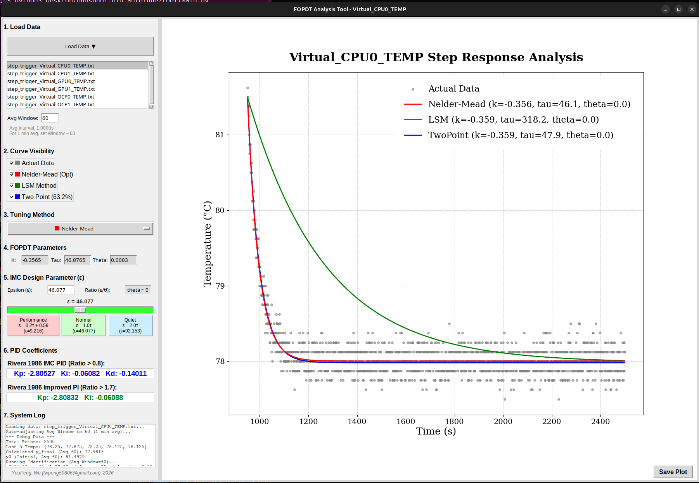

# phosphor-pid-autotune

`phosphor-pid-autotune` is an OpenBMC tool designed to automate the tuning of
PID control loops for fans. It performs step-response experiments to identify
the thermal process model (First Order Plus Dead Time - FOPDT) and calculates
optimal PID gains using the Internal Model Control (IMC) tuning method.

A compact, GitHub-friendly derivation of **FOPDT**

$$
G(s)=\frac{k e^{-\theta s}}{\tau s + 1}
$$

and **IMC PID** rules is in **[`docs/fopdt.md`](docs/fopdt.md)**.

## Features

- **Automated Step Experiments**: Runs open-loop step response tests on standard
  DBus fan/sensor objects.
- **Process Identification**: Identifies Plant Gain (K), Time Constant (Tau),
  and Dead Time (Theta) using the Two-Point Method.
- **IMC Tuning**: Calculates optimal PID gains (Kp, Ki, Kd) interactively using
  the GUI tool based on the identified FOPDT model.
- **Service Management**: Automatically stops the conflicting
  `phosphor-pid-control` service during tuning and restarts it afterwards.
- **Data Logging**: Generates detailed text-based logs (TXT format) for
  post-analysis using the provided GUI tool.

## Repository Layout

```
phosphor-pid-autotune
├── buildjson/                  # JSON config loader
├── configs/                    # Runtime configuration (autotune.json)
├── core/                       # DBus I/O and general utilities
├── dbus/                       # DBus service/path constants
├── docs/                       # FOPDT math documentation & images
├── experiment/                 # Step test logic (State Machine)
├── process_models/             # FOPDT identification logic
├── solvers/                    # Optimization solvers (Nelder-Mead, etc.)
├── tool/                       # Python GUI Analysis Tool
│   ├── app/                    # GUI package source
│   └── main.py                 # Tool entry point
├── main.cpp                    # Main entry point & DBus service
├── meson.build                 # Build configuration
├── phosphor-pid-autotune.bb    # Yocto recipe
└── phosphor-pid-autotune.service.in
```

## Configuration

The configuration is loaded from
`/usr/share/phosphor-pid-autotune/configs/autotune.json` (or via command line
argument).

### Structure (`autotune.json`)

```json
{
  "basicsetting": [
    {
      "pollinterval": 0.5,
      "windowsize": 120,
      "plot_sampling_rate": 5
    }
  ],
  "experiment": [
    {
      "initialfansensors": ["PWM_DUTY0", "PWM_DUTY1", ...],
      "initialpwmduty": 179,
      "aftertriggerfansensors": ["PWM_DUTY4", "PWM_DUTY5", ...],
      "aftertriggerpwmduty": 204,
      "initialiterations": 600,
      "aftertriggeriterations": 600,
      "tempsensor": "CPU0_TEMP"
    },
    {
      "initialfansensors": ["PWM_DUTY0", "PWM_DUTY1", ...],
      "initialpwmduty": 150,
      "aftertriggerfansensors": ["PWM_DUTY0", "PWM_DUTY1", ...],
      "aftertriggerpwmduty": 180,
      "initialiterations": 600,
      "aftertriggeriterations": 600,
      "tempsensor": "CPU1_TEMP"
    }
  ]
}
```

## Usage

### 1. Start the Service

```bash
systemctl start phosphor-pid-autotune.service
```

Starting the service **does not** immediately run the experiment. It enters an
idle state waiting for a D-Bus trigger. Note: When the experiment starts,
`phosphor-pid-control.service` will be stopped to prevent interference.

### 2. Trigger the Experiment

**Trigger a specific sensor** (e.g., `CPU0_TEMP`):

```bash
busctl set-property xyz.openbmc_project.PIDAutotune \
    /xyz/openbmc_project/PIDAutotune/CPU0_TEMP \
    xyz.openbmc_project.PIDAutotune.steptrigger Enabled b true
```

**Trigger ALL configured sensors** simultaneously:

```bash
busctl set-property xyz.openbmc_project.PIDAutotune \
    /xyz/openbmc_project/PIDAutotune/alltempsensor \
    xyz.openbmc_project.PIDAutotune.steptrigger Enabled b true
```

### 3. Retrieve Results

Logs are generated in `/var/lib/phosphor-pid-autotune/log/<SensorName>/`:

- `step_trigger_<SensorName>.txt`: Raw time-series data (Temp, PWM, Slope,
  RMSE).
- `fopdt_<SensorName>.txt`: Identified model parameters (632, LSM, and
  Optimization).
- `noise_<SensorName>.txt`: Noise and stability analysis summary.

## Analysis Tools

A Python GUI tool is provided to visualize the results and calculate PID gains
interactively.

### Run the GUI

```bash
python3 tool/main.py
```

### Analysis Example

The GUI tool allows you to visualize experimental data and identify FOPDT
parameters.



_Figure 1: FOPDT Analysis Tool Interface_

## Mathematical Details

See [`docs/fopdt.md`](docs/fopdt.md) for the derivation of the FOPDT model and
IMC tuning rules.

## License

Apache-2.0
